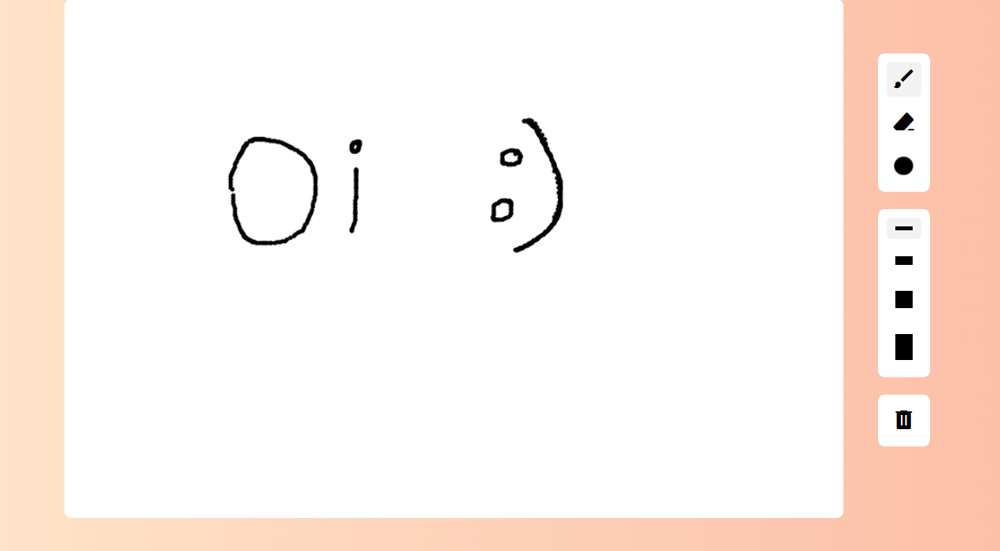

# Web Paint

Este projeto é uma aplicação de desenho chamada **Web Paint**, desenvolvida com **HTML**, **CSS** e **JavaScript**. O objetivo é criar uma ferramenta de pintura interativa que permite aos usuários desenhar e apagar no canvas. Este projeto foi uma ótima oportunidade para treinar minhas habilidades em JavaScript.

## 🛠️ Tecnologias Utilizadas

- **HTML5**: Estruturação semântica do conteúdo da página.
- **CSS3**: Estilização e layout do aplicativo.
- **JavaScript**: Funcionalidades interativas, como desenho, escolha de cores e ferramentas.

## 📸 Screenshots

    

## 🚀 Funcionalidades

- **Desenho**: Permite que os usuários desenhem no canvas com uma ferramenta de pincel.
- **Borrachinha**: Possibilita apagar partes do desenho utilizando uma ferramenta de borracha.
- **Escolha de Cores**: Os usuários podem escolher a cor do pincel através de um seletor de cores.
- **Escolha de Tamanhos**: O tamanho do pincel pode ser ajustado com diferentes botões de tamanho.
- **Limpar Canvas**: Uma opção para limpar todo o conteúdo do canvas.

## 📝 Aprendizados

- **Manipulação de Canvas**: Aprendi a usar a API Canvas do HTML5 para criar gráficos e desenhos.
- **Eventos do Mouse**: Melhorei minha compreensão sobre como lidar com eventos do mouse, como `mousemove`, `mousedown` e `mouseup`.
- **Desenvolvimento de Funcionalidades**: Pratiquei a implementação de diferentes ferramentas (pincel e borracha) e a interação do usuário com a interface.

